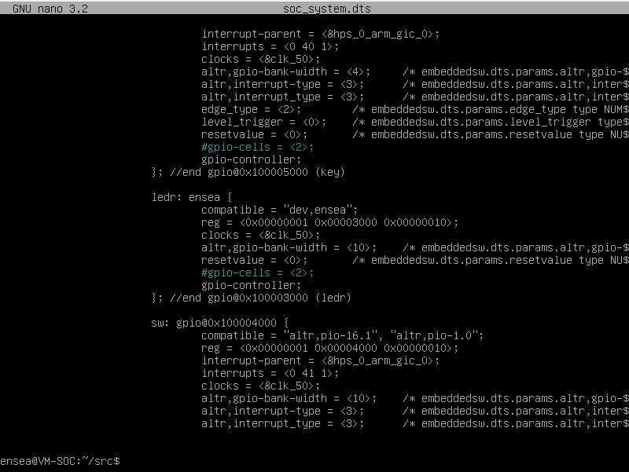

###TP Linux Embarqué###

**1.** **Prise en main :**\
**1.1.** **Préparation de la carte SD**\
Premièrement, nous avons procédé au téléchargement des ressources
requises pour cette séance pratique. Ensuite, nous avons utilisé le
logiciel Win32DiskImager sous Windows pour flasher la carte SD avec 
l'image fournie par Terasic, nommée VEEK_MT2S_LXDE/VEEK_MT2S_LXDE.img.

**1.2.** **Démarrage**\
Nous avons introduit la carte SD programmée et mis en marche la carte.
Sur le bureau de LXDE, nous avons accès aux commandes pour les LEDs, les
afficheurs 7 segments, les boutons, les interrupteurs, le gyro et
l\'écran LCD. De plus, nous disposons d\'un navigateur et de toutes les
applications Linux disponibles.

**1.3.** **Connexion au système**\
**1.3.1.Liaison série**\
Nous avons employé le câble USB mini : UART vers USB avec les paramètres
suivants :

• Identifiant : root

• Mot de passe : aucun (appuyez simplement sur Entrée)\
Ensuite, nous avons redémarré le SoC afin d\'observer la séquence de
démarrage en utilisant la commande reboot. Pendant ce redémarrage, tous
les processus sont interrompus. Le système propose une option
d\'annulation du redémarrage, puis il lance le noyau.

> 

**1.3.2.Configuration réseau**\
Lors de la connexion de la carte VEEK sur le switch, l\'adresse qui nous
est assignée À l'aide de la commande **ifconfig** est la suivante :
**192.168.88.73.**

Après avoir rebooté le système une nouvelle adresse nous es attribué,
cette dernière est:

**192.168.88.68** Donc l'adresse peut être modifiée lors d'un reboot, le
ping fonctionne correctement.

.

> 

**1.4.** **Découverte de la cible**\
**1.4.1.Exploration des dossiers /sys/class et /proc**

Sous la racine, nous retrouvons les répertoires suivants **: /usr,
/proc, /root, /sys,** etc. En exécutant la commande **cpuinfo**, on
constate la présence d\'un processeur dual core. Le fichier ioports est
vide, car sur un processeur ARM, les périphériques sont mappés dans la
mémoire (ce qui nécessite l\'utilisation de **iomem**). En revanche, sur
un PC ou une machine virtuelle, les périphériques ne partagent pas le
même bus, d\'où la nécessité de passer par **le ioports** pour y
accéder. Le répertoire /sys/class renferme également des périphériques
supplémentaires tels que GPIO, DMA, I2C, etc.

**1.4.2.Hello world !**

Lorsque l\'on tente d\'exécuter le fichier sur la machine virtuelle,
cela s\'avère impossible en

raison de sa nature binaire. Cependant, son exécution sur la carte
fonctionne parfaitement.

**1.4.3.** **Accès au matériel**

Un certain nombre de drivers sont fournis. Comme tous les drivers sous
Linux,

ils sont accessible sous forme de fichiers. Par exemple pour allumer
l'une des LED

rouge de la carte, il suffit d'écrire un '1' dans le bon fichier.

**echo \"1\" \> /sys/class/leds/fpga_led1/brightness**

**1.4.4.** **Chenillard (Et oui, encore !)**\
Nous avons développé le code pour créer un effet de chenillard, et il
fonctionne de manière optimale.

> Dans ce code, nous accédons aux fichiers fpga_led1/brightness,
> fpga_led2/brightness, etc., puis nous modifions les valeurs des LEDs
> en effectuant une écriture.

 **2. Modules kernel (TP2)**

 **2.1.** **Reprise du TP1**

Nous avons établi une connexion réussie et une communication avec la
carte VEEK. Toutefois, nous avons dû ajuster l\'adresse IP lors de la
connexion à Putty, car celle-ci avait changé.

**2.2.Accès aux registres**\
Un programme qui accède directement aux registres depuis l'espace
utilisateur.

> 

> **Limitations de mmap():**

 Les mappages de mémoire sont toujours ajustés à des multiples entiers
 de pages, entraînant un gaspillage d\'espace libre. Avec des pages de
 4 Ko, par exemple, un mappage de 7 octets gaspille 4 089 octets,
 surtout pour les petits fichiers. Ils doivent s\'insérer dans
 l\'espace d\'adressage du processus. En environnement 32 bits, de
 nombreux mappages de tailles différentes peuvent fragmenter l\'espace
 d\'adressage, compliquant la recherche de régions libres continues.
 Cette problématique est bien moins prononcée en 64 bits. La création
 et la gestion des mappages de mémoire engendrent une surcharge,
 généralement évitée en éliminant la double copie, surtout pour les
 fichiers volumineux et fréquemment utilisés.

**2.3.** **Compilation de module noyau sur la VM**

 Pour compiler des modules noyau dans la VM, nous avons besoin des
 paquets suivant :

> 

En utilisant le Makefile et le fichier source hello.c disponibles sur
Moodle, nous avons réussi à compiler notre premier module.

Les commandes suivantes ont été utilisées :\
- Pour charger le module : \`sudo insmod \<nom_du_module.ko\>\`\
- Pour décharger le module : \`sudo rmmod \<nom_du_module.ko\>\`\
- Pour obtenir des informations sur le module : \`sudo modinfo
\<nom_du_module.ko\>\` - \`sudo lsmod\` : pour afficher le statut des
modules dans le noyau Linux, fournissant une liste des modules chargés.

\- \`sudo dmesg\` : permet d\'afficher les messages dans le journal du
noyau.

Nous avons testé l\'ensemble de ces fonctions, et elles ont toutes
fonctionné de manière optimale.

Pour ajouter un paramètre, nous avons ajouté quelques lignes:

> 

Pour inclure une entrée dans le système de fichiers proc :

> 

Pour ajouter un timer:

> 

 **2.4.** **Récupération du Noyau Terasic**

> c'est déjà fait dans la VM !

**2.4.1.** **Préparation de la compilation**

> 

Il faut bien retenir ce chemin car on en aura besoin pour la suite.

> 

**2.4.2.** **Récupération de la configuration actuelle du noyau**

> ***--- Quel est le rôle des lignes commençant par export ?***

Elles sont destinées à établir des variables d\'environnement pouvant
être exploitées tout au long de l\'exécution du shell.

> ***--- Pourquoi le chemin fini par un tiret \"-\" ?***

 Cela s\'explique par le fait que la ligne dans le makefile est suivie
 d\'une commande gcc,
 éliminant ainsi la nécessité de le spécifier explicitement.

**2.4.3.** **Hello World**          

 La compilation se déroule sans problème. En chargeant le module et en utilisant la commande dmesg, on peut observer l\'affichage du message \"Hello, World\". 

**2.4.4.** **Chenillard (Yes !)**                             
                              

 Au sein de cette section, nous avons utilisé un timer pour ajuster la
 fréquence d\'affichage en fonction d\'un paramètre d\'entrée. Les
 résultats sont probants : en modifiant ce paramètre, la vitesse
 d\'affichage dans dmesg fluctue. Pour confirmer cela, nous avons
 effectué des tests en configurant une vitesse très rapide, où chaque
 appel à dmesg révèle des changements fréquents, puis une vitesse très
 lente, où chaque appel à dmesg expose un changement à chaque fois.

 Ce clignotement prend en compte le motif défini dans un processus
 (proc). Dans notre cas, ce motif agit en altérant la direction de
 l\'affichage. Plutôt que de suivre

 une séquence ascendante telle que \"led1 led2 led3\", l\'affichage
 adopte une

 séquence décroissante, présentant \"led3 led2 led1\".

**3.Device tree (TP3)**

> 

**3.1.** **module accedant au LED via /dev**

> ***Quel sont les rôles des principales fonctions (probe, read, write,
> remove), et***
>
> ***quand entrent-elles en action ?***

- La fonction **probe** est invoquée lorsque le noyau détecte le
 périphérique des LEDs. Elle est appelée une seule fois et a pour rôle
 de réserver la mémoire, créer la structure pour stocker les
 informations telles que les registres, allumer les LEDs et initialiser
 le misc device.

- La fonction **read**, quand à elle, est utilisée pour lire la valeur
 des LEDs au moment de son appel, tandis que la fonction **write**
 permet de modifier la valeur des LEDs.

- Enfin, la fonction **remove** est dédiée à la suppression du pilote
 lorsque le périphérique n\'existe plus.

- On a ajouté des fonctions read et write pour chaque proc.

- La commande cat attend un caractère de fin de fichier.

- On remarque que la valeur est affichée en boucle lorsqu'on fait appel
 à cat, pour remédier à ce problème on a du créer une condition qui
 retourne un 0 si elle est respecté (0 pour fin de fichier), on a de
 nouveau tester notre programme avec le bout de code ajouté et nous
 avons pu constater le bon fonctionnement du command cat.

- le résultat de ce changement est ci-dessous:

- Par la suite nous avons déclaré une variable globale pour récupérer
 la structure qui s'occupe des leds et l'utiliser dans le
 timer_callback: pour changer la valeur des LEDs :

> 

- les deux lignes ci-dessus permettent de modifier la valeur des LEDS ,
 ainsi en allant lire les fichiers:\
  */proc/ensea/speed\
  */dev/ensea-led\
  */proc/ensea/dir\

- On récupère la valeur des variables puis par la suite on agit sur la
 vitesse, la direction et le pattern.
